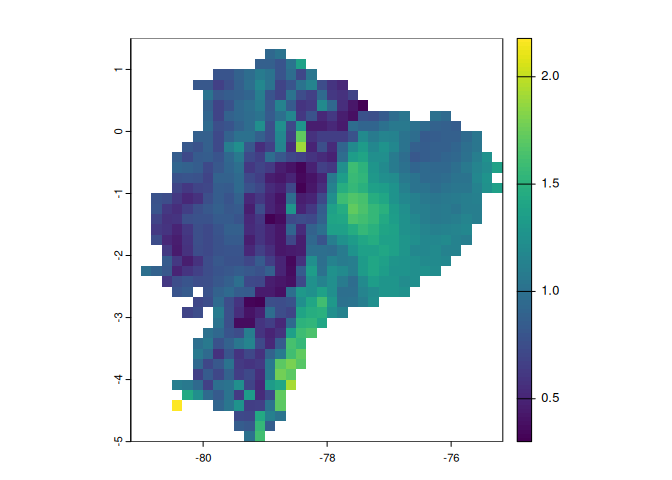
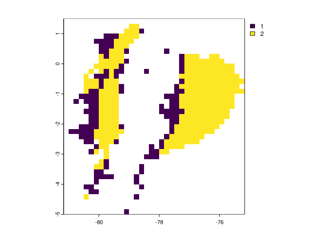
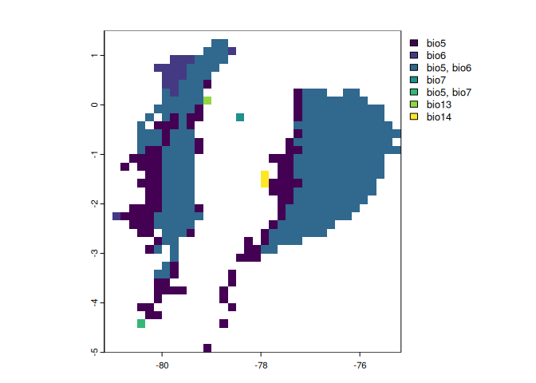
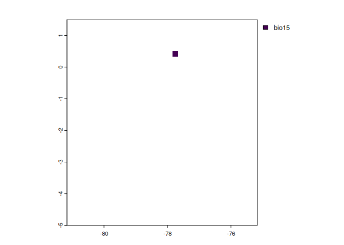

mop: Mobility Oriented-Parity Metric
================
Marlon E. Cobos, Hannah L. Owens, Jorge Soberón, A. Townsend Peterson

- [Installation](#installation)
  - [Install stable version from
    CRAN](#install-stable-version-from-cran)
  - [Install development version](#install-development-version)
- [Example](#example)
  - [Running analyses](#running-analyses)
  - [Plotting results](#plotting-results)

<!-- badges: start -->

[](https://github.com/marlonecobos/mop/actions)
<!-- badges: end -->

<hr>

The package `mop` contains a set of tools to perform the Mobility
Oriented-Parity (MOP) metric, which helps to compare a set of conditions
of reference versus another set of of interest. The main goals of the
MOP metric are to explore conditions in the set of interest that are
non-analogous to those in the reference set, and to quantify how
different conditions in the set of interest are. The tools included here
help to identify conditions outside the rages of the reference set with
greater detail than in earlier implementations. These tools are based on
the methods proposed by [Owens et
al. (2013)](https://doi.org/10.1016/j.ecolmodel.2013.04.011).

<br>

## Installation

### Install stable version from CRAN

To install the stable version of `mop` use:

``` r
install.packages("mop")
```

<br>

### Install development version

Before installing the development version of `mop`, make sure to obtain
the compilation tools required:
[Rtools](https://cran.r-project.org/bin/windows/Rtools/) for Windows,
[Xcode](https://apps.apple.com/us/app/xcode/id497799835?mt=12) for Mac,
and `ggc` or similar compilers in Linux, see examples
[here](https://gcc.gnu.org/install/) or
[here](https://www.makeuseof.com/how-to-install-c-compiler-linux/).

After that, you can install the development version of `mop` from its
[GitHub repository](https://github.com/marlonecobos/mop) with:

``` r
# install.packages("remotes")
remotes::install_github("marlonecobos/mop")
```

<br>

## Example

The following are basic examples of how to use the main function of the
package. First, load the package and some example data.

``` r
# package
library(mop)

# data
## current conditions
reference_layers <- terra::rast(system.file("extdata", "reference_layers.tif",
                                            package = "mop"))

## future conditions
layers_of_interest <- terra::rast(system.file("extdata",
                                              "layers_of_interest.tif",
                                              package = "mop"))

# plot the data
## variables to represent current conditions
terra::plot(reference_layers)
```


``` r

## variables to represent future conditions
terra::plot(layers_of_interest)
```


<br>

### Running analyses

The code below helps to run analyses with all the details implemented in
the function. To see more basic options and what they imply, check the
function documentation with `help(mop)`. Parallel processing is allowed
via arguments of this function.

``` r
# analysis
mop_basic_res <- mop(m = reference_layers, g = layers_of_interest, 
                     type = "detailed", calculate_distance = TRUE, 
                     where_distance = "all", distance = "euclidean", 
                     scale = TRUE, center = TRUE)
#>   |                                                                              |                                                                      |   0%  |                                                                              |===================================                                   |  50%  |                                                                              |======================================================================| 100%

# summary
summary(mop_basic_res)
#> 
#>                         Summary of MOP resuls
#> ---------------------------------------------------------------------------
#> 
#> MOP summary:
#> Values
#>       type scale center calculate_distance  distance percentage
#> 1 detailed  TRUE   TRUE               TRUE euclidean          1
#>   rescale_distance fix_NA N_m N_g
#> 1            FALSE   TRUE 723 723
#> 
#> Reference conditions
#>           bio5       bio6      bio7     bio13     bio14     bio15
#> min -3.1625758 -2.8057083 -3.609429 -2.002072 -1.170877 -1.027498
#> max  0.6507328  0.8513394  3.710556  2.779598  2.351446  3.174031
#> 
#> 
#> Distances:
#>       min      mean       max 
#> 0.3003245 0.9373088 2.1788036 
#> 
#> 
#> Non-analogous conditions (NAC):
#> Percentage = 0.566% of all contions
#> Variables with NAC in 'simple' = 2
#> 
#> 
#> Detailed results were obtained, not shown here

# print results
mop_basic_res
#> MOP distances:
#> class       : SpatRaster 
#> dimensions  : 39, 36, 1  (nrow, ncol, nlyr)
#> resolution  : 0.1666667, 0.1666667  (x, y)
#> extent      : -81.16667, -75.16667, -5, 1.5  (xmin, xmax, ymin, ymax)
#> coord. ref. : lon/lat WGS 84 (with axis order normalized for visualization) 
#> source(s)   : memory
#> name        :       mop 
#> min value   : 0.3003245 
#> max value   : 2.1788036 
#> 
#> MOP basic:
#> class       : SpatRaster 
#> dimensions  : 39, 36, 1  (nrow, ncol, nlyr)
#> resolution  : 0.1666667, 0.1666667  (x, y)
#> extent      : -81.16667, -75.16667, -5, 1.5  (xmin, xmax, ymin, ymax)
#> coord. ref. : lon/lat WGS 84 (with axis order normalized for visualization) 
#> source(s)   : memory
#> name        : mop 
#> min value   :   1 
#> max value   :   1 
#> 
#> MOP simple:
#> class       : SpatRaster 
#> dimensions  : 39, 36, 1  (nrow, ncol, nlyr)
#> resolution  : 0.1666667, 0.1666667  (x, y)
#> extent      : -81.16667, -75.16667, -5, 1.5  (xmin, xmax, ymin, ymax)
#> coord. ref. : lon/lat WGS 84 (with axis order normalized for visualization) 
#> source(s)   : memory
#> categories  : n_variables 
#> name        : n_variables 
#> min value   :           1 
#> max value   :           2 
#> 
#> MOP detailed:
#> interpretation_combined:
#>   values extrapolation_variables
#> 1  1e+01                    bio5
#> 2  1e+02                    bio6
#> 3  1e+03                    bio7
#> 4  1e+04                   bio13
#> 5  1e+05                   bio14
#> 6  1e+06                   bio15
#> ...
#> 
#> towards_low_end:
#> class       : SpatRaster 
#> dimensions  : 39, 36, 6  (nrow, ncol, nlyr)
#> resolution  : 0.1666667, 0.1666667  (x, y)
#> extent      : -81.16667, -75.16667, -5, 1.5  (xmin, xmax, ymin, ymax)
#> coord. ref. : lon/lat WGS 84 (with axis order normalized for visualization) 
#> source(s)   : memory
#> names       : bio5, bio6, bio7, bio13, bio14, bio15 
#> min values  :  NaN,  NaN,  NaN,   NaN,   NaN,     1 
#> max values  :  NaN,  NaN,  NaN,   NaN,   NaN,     1 
#> 
#> towards_high_end:
#> class       : SpatRaster 
#> dimensions  : 39, 36, 6  (nrow, ncol, nlyr)
#> resolution  : 0.1666667, 0.1666667  (x, y)
#> extent      : -81.16667, -75.16667, -5, 1.5  (xmin, xmax, ymin, ymax)
#> coord. ref. : lon/lat WGS 84 (with axis order normalized for visualization) 
#> source(s)   : memory
#> names       : bio5, bio6, bio7, bio13, bio14, bio15 
#> min values  :    1,    1,    1,     1,     1,   NaN 
#> max values  :    1,    1,    1,     1,     1,   NaN 
#> 
#> towards_low_combined:
#> class       : SpatRaster 
#> dimensions  : 39, 36, 1  (nrow, ncol, nlyr)
#> resolution  : 0.1666667, 0.1666667  (x, y)
#> extent      : -81.16667, -75.16667, -5, 1.5  (xmin, xmax, ymin, ymax)
#> coord. ref. : lon/lat WGS 84 (with axis order normalized for visualization) 
#> source(s)   : memory
#> categories  : extrapolation_variables 
#> name        : extrapolation_variables 
#> min value   :                   bio15 
#> max value   :                   bio15 
#> 
#> towards_high_combined:
#> class       : SpatRaster 
#> dimensions  : 39, 36, 1  (nrow, ncol, nlyr)
#> resolution  : 0.1666667, 0.1666667  (x, y)
#> extent      : -81.16667, -75.16667, -5, 1.5  (xmin, xmax, ymin, ymax)
#> coord. ref. : lon/lat WGS 84 (with axis order normalized for visualization) 
#> source(s)   : memory
#> categories  : extrapolation_variables 
#> name        : extrapolation_variables 
#> min value   :                    bio5 
#> max value   :                   bio14
```

<br>

### Plotting results

Below are some example plots of the results that can be obtained from
analysis with `mop`.

``` r
# difference between set of conditions of interest and the reference set
terra::plot(mop_basic_res$mop_distances)
```



``` r

# basic identification of non-analogous results
terra::plot(mop_basic_res$mop_basic)
```


``` r

# how many variables have non-analogous conditions
terra::plot(mop_basic_res$mop_simple)
```



``` r

# combinations of variables with non-analogous conditions towards high values
terra::plot(mop_basic_res$mop_detailed$towards_high_combined)
```



``` r

# combinations of variables with non-analogous conditions towards low values
terra::plot(mop_basic_res$mop_detailed$towards_low_combined)
```


